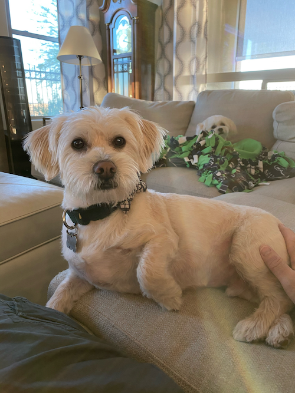
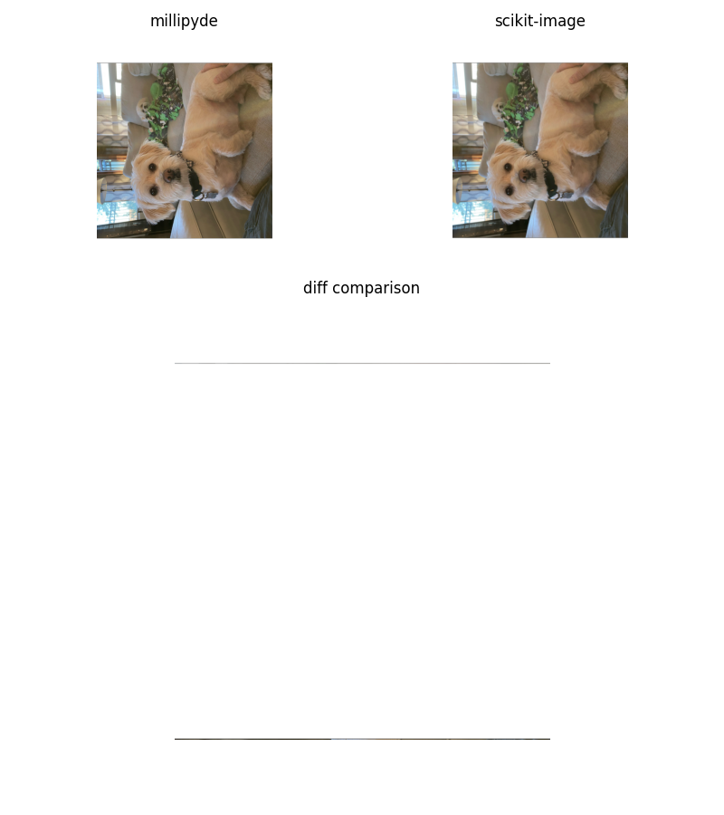

# Benchmarks

these benchmarks were created with the intent of comparing millipyde to similar tools

## USAGE

### Installing requirements

#### CPU BASED TOOLS TO BE COMPARED AND BENCHMARKING TOOL

the requirements are listed in `millipyde/benchmarks/requirements.txt`

with a python virtual environment or in the global python environment (whatever is preferred) run

```shell
pip -r benchmarks/requirements.txt
```

#### GPU BASED TOOLS

The GPU based tools; millipyde, opencv-cuda, and cupy must be installed/built separately and will not be installed by default

Also note the benchmarks will still be able to run without the aforementioned tool

<!-- TODO: installation instructions (links) for cupy and opencv-cuda -->

### RUNNING THE BENCHMARKS
> **Warning**
> All of the following commands require py.test to be installed and all of the cpu based benchmarking tools (skimage, opencv, and pillow) to be installed in the current python environment (global or virtual) as shown in the usage section

run all verification tests and benchmarks


```shell
py.test
```

run only benchmarks

```shell
py.test --benchmark-only
```

run only verification tests

```shell
py.test --benchmark-skip
```

> **Warning**
> To use the `--rounds`, `--warmup-rounds`, and `--images` options the command must be ran from within the `benchmarks` directory or the benchmarks directory must be passed to `py.test`.
> For example: 
>
> ```shell
> user@machine:~/millipyde$ py.test benchmarks --rounds 10
> ```
>
> or
>
> ```shell
> user@machine:~/millipyde/benchmarks$ py.test --images inputs/charlie12.png
> ```

## NOTES

The outputs of non-millipyde tools are as close as possible to the outputs of millipyde, however equality between the outputs was not always possible for the reasons listed below

### Common Problems

#### 1. the behavior of millipyde's gaussian blur function for inputs with 4 channels (rgba) results in an image with the alpha channel of each pixel set to max (i.e. 255 for u8 or 1.0 for float).

This is most likely a bug as it is the only image function with behavior other than that of the equivalent skimage function. This inconsistency with skimage is not shown in the comparisons ran by `run_tests.sh` as the `test_gaussian` function converts the image to grayscale before applying the gaussian blur.

Skimage, Cupy (whose gaussian function is based on the scikit implementation), and opencv do not have this behavior.

Additionally the results of skimage, cupy, and opencv match each other, but not millipyde, even when the alpha channel is ignored.

#### 2. multiple tools have strange behavior at the edges when rotating 90 degrees

pillow, cupy, skimage, and millipyde all output images with different edges at the top and bottom of the rotated image. this is best explained with an image

**ORIGINAL**



**AFTER 90 DEGREE ROTATION**



This difference was deemed acceptable as it only resulted in ~ 8% of pixels being mismatched in the worst case (the image above) and the difference decreased the larger the input image.

### Tool Specific Problems/Notes

#### Cupy

Because of how Cupy (and numpy) store arrays, a transpose is simply a permutation on the axes, i.e. it does very little work. I'm including this note to help explain why cupy's transpose is so much faster than the other tools.

#### Opencv

1. The builtin rotate method was not used for the `rotate_90_deg` function as it resized the image. Instead the opencv methods for generating and applying were used

2. opencv and scikit image compute the kernel size based on sigma differently when doing gaussian blur. For the cpu implementation of opencv the kernel size was computed the same way scikit image does as scikit image is what the millipyde functions seem to be based on, however for the cuda implementation there is an (arbitrary?) restriction on the kernel dimensions. The closest possible kernel size was used.
